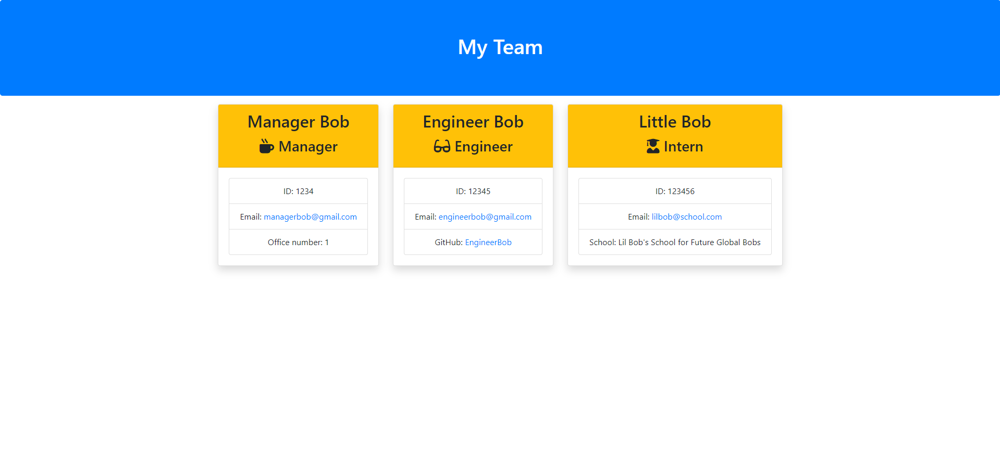

# team-profile-generator
by Sarenne89

## This file was generated using the README-Generator.
## Table of contents
- [Description](#description)
- [License](#License)
- [Install](#install)
- [Usage](#Usage)
- [Testing](#testing)
- [Contributors](#contributors)
- [Contact](#contact)
## Description
In this task, we have been asked to create a team profile generator using Node and Inquirer. The user is asked questions in the command line in order to create profiles for a dev team, including a manager, engineers and interns, and then outputs that information into a new directory and html file. 

## License
MIT
## Install
npm i
## Testing
Tests can be run on the various different employee creation files using "npm test 'insertFileNameHere'" from the command line on the "_tests_" folder.
## Contributors
edX Bootcamp Instructors and staff
## Questions? Contact me!
- Name - Matt Dunmore
- Email - mdunmore89@gmail.com
- Github - [Sarenne89](https://github.com/Sarenne89)
